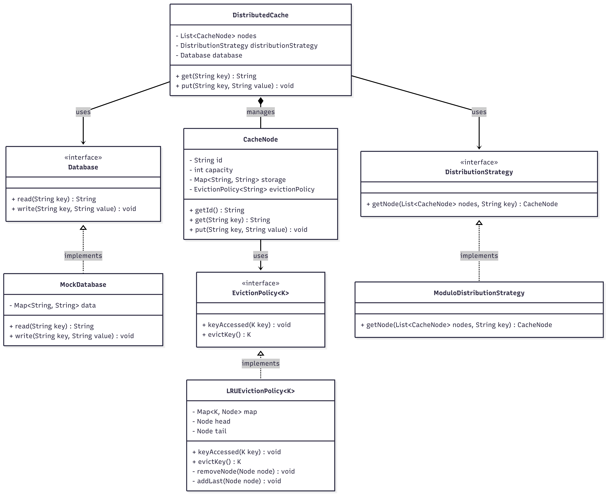

# Distributed Cache System

An object-oriented design for a distributed, in-memory caching system demonstrating extensibility and SOLID principles.

## System Design Details

* **Distribution Strategy:** Determines the routing of keys to physical/logical cache nodes. Abstracted via the `DistributionStrategy` interface. The default implementation utilizes a simple modulo hash approach, but consistent hashing can be seamlessly injected.
* **Eviction Policy:** Handles memory capacity limits on individual nodes. Abstracted via the `EvictionPolicy` interface. The `LRUEvictionPolicy` implements a thread-safe Doubly Linked List and Hash Map mechanism for O(1) eviction and access updates. Future policies (LFU, MRU) can implement the same interface.
* **Cache Miss Handling:** The `DistributedCache` class acts as the orchestrator. Upon a cache miss, it fetches the data directly from the `Database` interface and hydrates the appropriate `CacheNode` before returning the payload to the caller.

## Class Diagram



## How to Run

Compile and execute all classes using standard Java commands in the root directory:

```bash
javac *.java
java Main