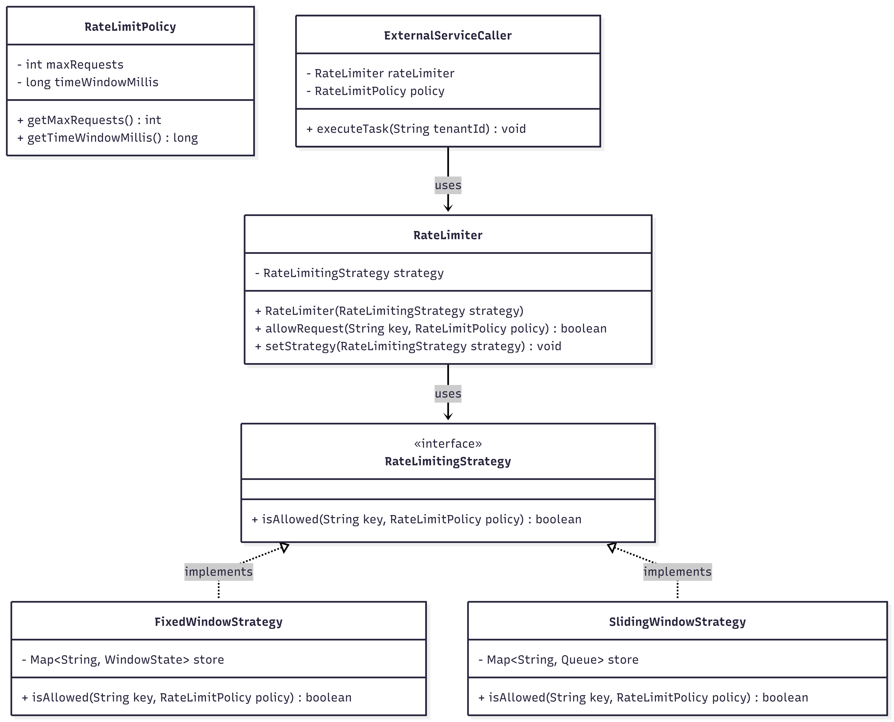

# Pluggable Rate Limiter 🚦

An extensible, object-oriented rate limiting system in Java designed to control external resource usage. 

## System Architecture

* **Strategy Pattern:** Core algorithms (`FixedWindowStrategy`, `SlidingWindowStrategy`) are abstracted behind the `RateLimitingStrategy` interface. This allows seamless switching of rate-limiting logic at runtime without modifying the business logic (Open/Closed Principle).
* **Context/Manager:** The `RateLimiter` acts as the execution context, utilizing the injected strategy to evaluate requests against a defined `RateLimitPolicy` (e.g., 5 requests per minute).
* **Thread Safety:** State storage utilizes `ConcurrentHashMap`, `AtomicInteger`, and `ConcurrentLinkedQueue` to ensure atomic operations and thread-safe execution in concurrent environments.

## Class Diagram



## How to Run

Compile and execute all classes using standard Java commands in the root directory:

```bash
javac *.java
java Main